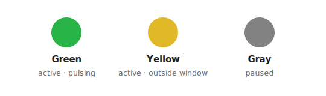
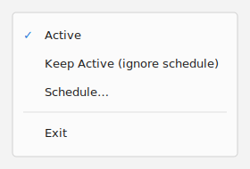
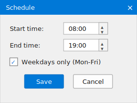

# KeepAwakeTray

[](https://github.com/srmalo/KeepAwakeTray/actions/workflows/build.yml)

A tiny Windows system-tray app that keeps your session awake — **without typing
keystrokes and without moving the cursor**.

> **Download:** grab the latest compiled `KeepAwakeTray.exe` from the
> [**Releases**](https://github.com/srmalo/KeepAwakeTray/releases/latest) page
> (built automatically on every push), or build it yourself (see below).

Many corporate environments lock the workstation after a few minutes of
inactivity (a secure screen saver enforced by policy). Power-only tools (such as
PowerToys Awake) do **not** prevent this: they manage the sleep/display API but
not the user-inactivity counter. Tools like Caffeine reset the counter by
simulating the **F15** key — which works, but injects a stray `~` into terminal
apps like PuTTY.

KeepAwakeTray instead simulates a **mouse move of (0, 0)** via `SendInput`. That
resets the inactivity counter **without moving the cursor and without injecting
any character**, so terminals stay clean. It *also* asks Windows to keep the
display on and the machine out of sleep (via `SetThreadExecutionState`) while
it's pulsing.

## Features

- 🟢 / 🟡 / ⚪ tray icon showing the current state (DPI-aware, crisp on scaled displays).
- Manual on/off toggle (double-click or menu).
- **Keep Active** override that ignores the schedule for the current session.
- Optional **time window** (e.g. 08:00–19:00) and **weekdays-only** gating;
  windows that cross midnight are supported, and `start == end` means **24h**.
- Settings dialog (right-click → *Schedule…*) with `HH:mm` time pickers.
- Blocks **display-off and sleep** while pulsing (`SetThreadExecutionState`).
- **Single-instance** guard — launching twice won't create two tray icons.
- **Configurable** config-file location (`-config`), defaulting next to the exe.
- Human-editable `KeepAwakeTray.ini`.
- Single self-contained `.exe`, no runtime dependencies beyond .NET Framework
  (already present on Windows 10/11).

## Interface

The tray icon shows the current state at a glance:



Right-click the icon for the menu, and open **Schedule…** to set the time window:

<p>
  
  &nbsp;&nbsp;
  
</p>

> Illustrations of the UI (labels and layout match the app).

### Icon states

| Icon | Meaning |
|------|---------|
| 🟢 Green  | Active and pulsing (Keep Active, or inside the window). |
| 🟡 Yellow | Active but waiting — outside the schedule (outside the time window, or a non-weekday when Weekdays-only is on) — not pulsing. |
| ⚪ Gray   | Paused manually. |

## Usage

- **Double-click** the tray icon → toggle active/paused.
- **Right-click → Keep Active (ignore schedule)** → session override: keep awake
  regardless of the schedule (also forces Active). Not persisted — resets to the
  schedule when the process restarts.
- **Right-click → Schedule…** → set start/end time (`HH:mm`) and the
  weekdays-only option. Changes apply immediately and are saved.
- **Right-click → Exit** → quit.

It sends a pulse every 50 seconds, but **only** when **active** *and*
(**Keep Active** *or* inside the configured window) — and, if enabled, on
weekdays only. While it is pulsing it also keeps the display on and prevents the
machine from sleeping; when it stops pulsing (paused, or outside the window) that
hint is released and normal power behavior resumes.

## Command-line options

```text
KeepAwakeTray.exe [-keepon] [-config <dir|file.ini>]
```

| Option | Description |
|--------|-------------|
| `-keepon` | Start with **Keep Active** already on (handy for an "always on" shortcut). Not persisted. |
| `-config <path>` | Location of the `.ini`. A **directory** (the file becomes `<dir>\KeepAwakeTray.ini`) or an explicit `*.ini` **file**. Environment variables are expanded (e.g. `-config "%APPDATA%\KeepAwakeTray"`); a relative path is resolved next to the exe. **Default:** `KeepAwakeTray.ini` next to the executable. |

## Configuration

`KeepAwakeTray.ini` is created on first run (next to the exe, or wherever
`-config` points). Edit it from the menu dialog or by hand:

```ini
StartTime=08:00
EndTime=19:00
WeekdaysOnly=1
```

- Edits from the menu apply on the fly; edits by hand take effect on the next start.
- Windows that **cross midnight** are supported (e.g. `20:00`–`06:00`).
- `StartTime == EndTime` (e.g. `00:00`–`00:00`) is treated as **all day (24h)**,
  still subject to the weekdays-only setting.
- `WeekdaysOnly` accepts `1/true/yes/on/y` and `0/false/no/off/n`; an
  unrecognized value leaves the current setting unchanged (it won't silently flip).

## Keeping awake vs. locking — what it can and can't do

KeepAwakeTray is an **input-idle** keep-awake tool. That defeats the lock
mechanisms that are driven by user-input inactivity, but not those driven by
other signals:

| Lock mechanism | Defeated? |
|---|---|
| Secure screen saver ("require sign-in on resume") | ✅ Yes |
| *Machine inactivity limit* (`InactivityTimeoutSecs` GPO) | ✅ Yes (input path) |
| Windows 11 **Dynamic Lock** (Bluetooth) | ✅ Yes (only locks when *idle* **and** signal drops) |
| Display-off / sleep (power plan) | ✅ Blocked while pulsing (`SetThreadExecutionState`) |
| **Presence sensor** ("lock on leave") | ❌ No — triggers on human absence, not input idle |
| Manual lock (Win+L) / lid close | ❌ No |

## Elevated apps & UIPI (important)

If you run apps **as administrator** (e.g. an elevated terminal, admin consoles),
run KeepAwakeTray **elevated too**. Windows **UIPI** (User Interface Privilege
Isolation) blocks a normal-integrity process from sending input to a
higher-integrity **foreground** window — so a non-elevated KeepAwakeTray's pulse
is **silently dropped** while an elevated window is focused (and `SendInput` even
returns "success", so there's no error to see). The session then locks anyway.

The clean fix is a **scheduled task that runs elevated at logon** — it
auto-starts at high integrity with **no UAC prompt**:

```powershell
$exe     = 'C:\Path\To\KeepAwakeTray.exe'
$action  = New-ScheduledTaskAction -Execute $exe -Argument '-config "C:\Path\To"'
$trigger = New-ScheduledTaskTrigger -AtLogOn -User "$env:USERDOMAIN\$env:USERNAME"
$princ   = New-ScheduledTaskPrincipal -UserId "$env:USERDOMAIN\$env:USERNAME" `
             -LogonType Interactive -RunLevel Highest
$set     = New-ScheduledTaskSettingsSet -AllowStartIfOnBatteries `
             -DontStopIfGoingOnBatteries -ExecutionTimeLimit 0
Register-ScheduledTask -TaskName 'KeepAwakeTray' -Action $action -Trigger $trigger `
  -Principal $princ -Settings $set -Force
```

> If you use this elevated task, avoid *also* launching a non-elevated shortcut:
> the single-instance guard means whichever starts first wins, and a
> medium-integrity instance would land you back in the UIPI-blocked state. Point
> any manual launcher at the task instead (`schtasks /run /tn KeepAwakeTray`).

## Build

No IDE required — the .NET Framework C# compiler ships with Windows:

```powershell
& "$env:WINDIR\Microsoft.NET\Framework64\v4.0.30319\csc.exe" /nologo /target:winexe `
  /out:KeepAwakeTray.exe `
  /reference:System.dll /reference:System.Drawing.dll /reference:System.Windows.Forms.dll `
  KeepAwakeTray.cs
```

> Targets **.NET Framework** (uses the classic `ContextMenu`/`MenuItem`). To port
> to .NET 5+/8, swap those for `ContextMenuStrip`/`ToolStripMenuItem`/`ToolStripSeparator`.

## Run at logon

- **Simple (per-user, medium integrity):** place a shortcut to `KeepAwakeTray.exe`
  in your Startup folder (`shell:startup`). Good enough if you don't keep elevated
  windows focused.
- **Recommended if you use elevated apps:** the elevated **scheduled task** above
  (runs at logon, high integrity, no UAC prompt).

> Launch it from your **user session**. A process started by an automation host
> can be terminated when that host exits.

## Notes & limitations

- Prevents the **inactivity** lock and (while pulsing) display-off/sleep. It
  cannot stop a manual lock (Win+L), a lid-close, or a presence-sensor "lock on leave".
- Once the screen is locked, it cannot unlock it — by design, simulated input
  from the default desktop does not reach the secure logon desktop.
- On managed/corporate devices an enforced inactivity lock is often a security
  control; check your acceptable-use policy before circumventing it, and note that
  injected input carries the `LLMHF_INJECTED` flag that endpoint tooling can detect.

See [CHANGELOG.md](CHANGELOG.md) for version history.

## License

MIT
